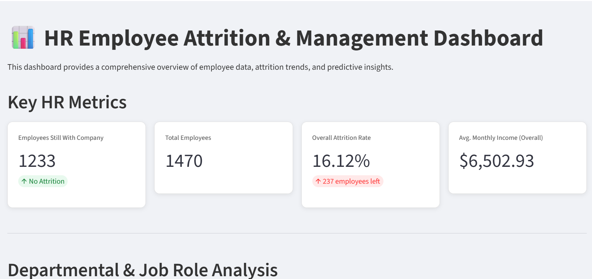
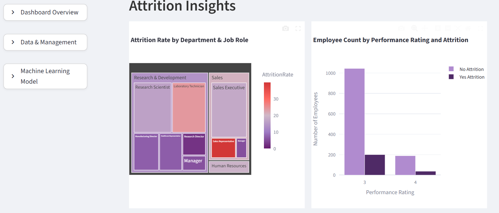

# HR-Dashboard-Project
🧑‍💼 HR Employee Attrition Analysis 
  
  
  

An interactive HR analytics dashboard that empowers the HR department to analyze employee data, uncover key attrition insights, and make data-driven retention decisions. 
This project analyzes employee attrition using **SQL, Python(Pandas), and Streamlit**.

---
## Table of Contents
- [Project Overview](#-Project-Overview)
- [Data Source & Dictionary](#data-source--dictionary)
- [Key Features](#key-features)
- [Tech Stack](#tech-stack)
- [Installation & Usage](#-installation--usage)
- [License](#license)
- [Author & Acknowledgments](#-author--acknowledgments)
---
## 📊 Project Overview
Employee attrition (turnover) is a critical challenge for organizations.  
In this project, we:
- Load and clean HR dataset
- Store data in an SQLite database
- Answer business questions with **SQL queries**
- Perform analysis with **Pandas**
- Visualize results in an interactive **Streamlit dashboard**
---
## Data Source & Dictionary
Dataset Source: ( https://www.kaggle.com/datasets/pavansubhasht/ibm-hr-analytics-attrition-dataset)
Provide a brief data dictionary explaining some of the most important columns.

---
## 🔑Key Features
- Compare attrition rates across multiple factors
- Visualize attrition trends with interactive charts
- SQL + Pandas dual analysis for validation

---

## 🛠️Tech Stack
- **Python** (Pandas, SQLite3, Matplotlib/Seaborn)
- **SQL** (for querying HR database)
- **Streamlit** (for interactive dashboard)
- **VSCode** (development environment)
- **Git/GitHub** (version control)

---

## 🚀 Installation & Usage

### 1. Clone the repo
```bash
git clone https://github.com/RazanAlkhaluqy/HR-Dashboard-Project.git
cd HR-Dashboard-Project
```
### 2. Create a virtual environment (recommended)
```bash
conda create -n hrproject python=3.10 -y
conda activate hrproject
```
### 3. Install dependencies
---
```bash
pip install -r requirements.txt
```
(if you don’t have a requirements.txt, you can create one with pip freeze > requirements.txt)

### 4. Set up the database

Make sure your SQLite database (employee.db) is in the project folder.
If not, run your data preparation notebook (analysis.ipynb) first to generate it.

### 5. Run the app (Streamlit)
```bash
 python app.py
```
```bash
streamlit run dashboard.py
```
---
### 6. Author & Acknowledgments

---
## License
This project is licensed under the MIT License - see the [LICENSE](LICENSE) file for details.

---
### Dashboard page




